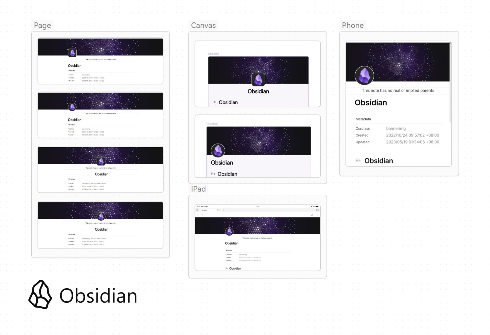

## MinnerBanner

Support
- Wikilink image file

Not Support Now
- emoji



### How to Use

```
---
cssclass: bannerimg
---
```

For Banner image: `![[xxxx.png##bannerimg]]`

For Banner icon: 
- Align Left:`![[xxxx.png##bannericonl]]` 
- Circle and Align Left:`![[xxxx.png##bannericonlc]]`
- Align Center:`![[xxxx.png##bannericonc]]`
- Circle and Align Center:`![[xxxx.png##bannericoncc]]`

For Title Align:
```
---
cssclass: banner-title-center
---
```
