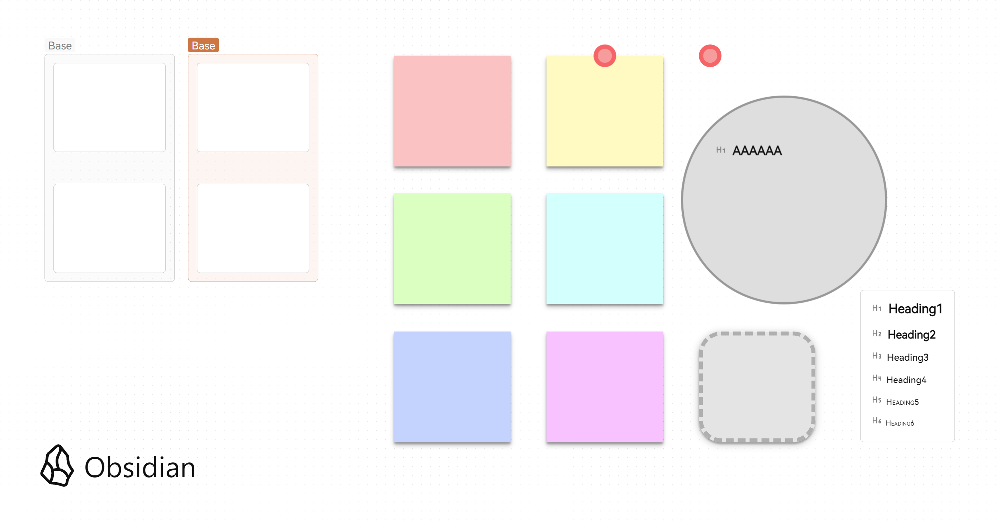

## Canvas

Thanks for : [Quick Guide: Customizing your canvas](https://forum.obsidian.md/t/quick-guide-customizing-your-canvas-rotating-nodes-removing-borders-backgrounds/52125)

This snippet provides:
- 6 sticky
- 2 shape
- 1 card



## How to Use

```
---
cssclass: sticky005
---
```

- sticky001
- sticky002
- sticky003
- sticky004
- sticky005
- sticky006
- card001
- shape001
- shape002